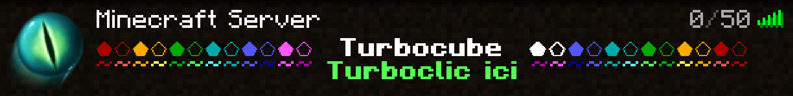

<br />
<div align="center">
  <a href="https://github.com/Turbocube/server-1.19">
    
  </a>

  <h3 align="center">Turbocube server</h3>

  <p align="center">
    The third turbocube minercraft server version!
    <br />
    <a href="https://github.com/Turbocube/server-1.19">View Demo</a>
    ·
    <a href="https://github.com/Turbocube/server-1.19/issues">Report Bug</a>
    <br />
    <br />
  </p>
</div>

<details>
  <summary>Table of Contents</summary>
  <ol>
    <li>
      <a href="#getting-started">Getting Started</a>
      <ul>
        <li><a href="#installation">Installation</a></li>
        <li><a href="#usage">Usage</a></li>
      </ul>
    </li>
    <li><a href="#contributing">Contributing</a></li>
    <li><a href="#license">License</a></li>
    <li><a href="#contact">Contact</a></li>
    <li><a href="#acknowledgments">Acknowledgments</a></li>
  </ol>
</details>

## About The Project



We came up with the idea of this server to keep track of our Minecraft adventures.

Tired of recreating a new world every time you start a new survival or of losing your old worlds?
Then Turbocube is for you!

Our aim is to keep the game as vanilla as possible while adding a few cool features, here's a few of them:
* 🦄 DiscordLink: Discord/Minecraft link, allows you to link your Discord account and receive and send messages.
* 🗺️ DynMap: Minecraft's Google maps give you a 2D and 3D map of Turbocube
* 🧱 ClaimChunk: Allows you to claim chunks that will be visible on the map.

<p align="right">(<a href="#readme-top">back to top</a>)</p>

## Getting Started

Follow these steps to get the Turbocube server running on your local machine.

### Installation

1. Clone the repo
   ```sh
   git clone https://github.com/Turbocube/server-1.19.git
   ```
2. You can change the server settings in `spigot.yml`
3. Enter your Discord infos in `DiscordLink/config.yml`
   ```yml
   discord:
    token: YOUR DISCORD TOKEN
    server_id: YOUR SERVER ID
    owner_id: YOUR OWNER ID

    (...)
    crosschat:
      (...)
      channel_id: YOUR CHANNEL ID
   ```
4. And then your minecraft infos in `ops.json`
   ```json
    {
      "uuid": "YOUR_ID",
      "name": "YOUR_NAME",
      "level": 4,
      "bypassesPlayerLimit": false
    }
   ```

<p align="right">(<a href="#readme-top">back to top</a>)</p>

### Usage

To launch the server you can just do `./start.sh` or you can launch it manually:
```sh
java -Xms1G -Xmx2G -jar spigot-1.19.jar nogui
```

_For more details, please refer to the [Spigot wiki](https://www.spigotmc.org/wiki/spigot/)_

<p align="right">(<a href="#readme-top">back to top</a>)</p>

## Contributing

Contributions are what make the open source community such an amazing place to learn, inspire, and create. Any contributions you make are **greatly appreciated**.

If you have a suggestion that would make this better, please fork the repo and create a pull request. You can also simply open an issue with the tag "enhancement".
Don't forget to give the project a star! Thanks again!

1. Fork the Project
2. Create your Feature Branch (`git checkout -b feature/AmazingFeature`)
3. Commit your Changes (`git commit -m 'Add some AmazingFeature'`)
4. Push to the Branch (`git push origin feature/AmazingFeature`)
5. Open a Pull Request

<p align="right">(<a href="#readme-top">back to top</a>)</p>

## License

Distributed under the MIT License. See `LICENSE.txt` for more information.

<p align="right">(<a href="#readme-top">back to top</a>)</p>

## Contact

Alexis Knob - alexis@bonko.fr

Project Link: [https://github.com/Turbocube](https://github.com/Turbocube)

<p align="right">(<a href="#readme-top">back to top</a>)</p>

## Acknowledgments

Special thanks to the following resources and tools that have made this project possible:

* [Spigot server](https://www.spigotmc.org/)
* [DiscordLink](https://www.spigotmc.org/resources/discordlink.93969/)
* [ClaimChunk](https://www.spigotmc.org/resources/claimchunk.44458/)
* [DynMap](https://www.spigotmc.org/resources/dynmap%C2%AE.274/)

<p align="right">(<a href="#readme-top">back to top</a>)</p>